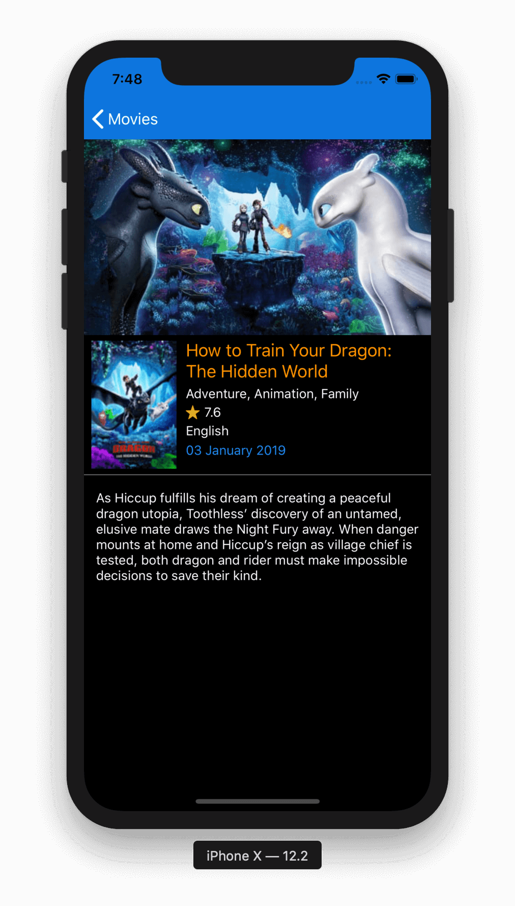

# MovieExplorer
A Movies Explorer App. Displays movies data fetched from themoviedb.org API.

## Getting Started

These instructions will get you a copy of the project up and running on your local machine for development and debugging purposes.

### Prerequisites

Application is using CocoaPods for dependency management. In order to install CocoaPods run following command on Terminal:

```
$ sudo gem install cocoapods
```
See [Getting Started on CocoaPods](https://guides.cocoapods.org/using/getting-started.html) for more informaiton.


### Installing
- Open Terminal and run following command to install pods:
```
$ pod install
```
- Navigate to project directory and open project using *MovieExplorer.xcworkspace*
- Build and run the application on simulator or actual device running iOS 10.0 or later using Xcode 10.2


## Features
- Latest movies information.
- Endless Scrolling (Pagination based on themoviedb.org api data)
- Movie details (e.g. Poster, Rating, Language, Release Date, Overview)

## User Guidelines
- Upon launching, app automatically fetches first page containing 20 movies.
- Scrolling to bottom causes app to fetch next page and new movies are appended in the list automatically.
- Tapping on Filter button will show a Date Picker, which can be used to filter movies on basis of release date.
- After selecting the date and taping on Done button, will cause app to filter locally persisted data. All movies that matches the selected date will be displayed or else table will be empty.
- Upon selecting any movie from the list will open movie detail page.
- Movie detail page will show, movie poster, banner, name, rating, language, and overview.
- Detail page hides poster in landscape mode. 


## Technical Notes

### Architecture
- For Architecture purpose MVVM is used along with Builder and Coordinator.
- Builder surves the modules construction prupose.
- Coordinator is used for navigation.
- RxSwift is used for binding mechanism. 
- CoreData is used for persistence mechanism.

### Code Structure
Code has been strucutred into three main categories, Sources, Resources and Supporting Files:
- Sources contain all code files, views, extensions, business logic, etc.
- Resources contains Assets, Fonts, etc.
- Supporting Files contain plist, and main file.

### Code Styling
- SwiftLint is configured and run script is added on build time, so Swift code is automatically indented upon each build.

### Third Party
- RxSwift (For MVVM binding plus handling  `NSFetchedResultsController` callbacks)
- Alamofire (For network calls, Service wrapper layer developed) 
- SwiftyBeaver (For console logging)
- SwiftLint (For autmatic code indentation)
- Kingfisher (For downloading and caching images)
- KRProgressHUD (For displaying progress)


## Sample Screens
[Movies]
[Detail]

* **See Application Video here:**  [AppPreview.mp4](Screenshots/AppPreview.mp4)


## Built With

* [CocoaPods](https://cocoapods.org/) - Dependency Management

## Versioning

Version 1.0
For more information on versioning, see [Semantic Versioning](http://semver.org/).

## Authors

* **Ahmad Ansari** - (https://github.com/ahmadansari)

## License

This project is licensed under the MIT License - see the [LICENSE.md](LICENSE.md) file for details


